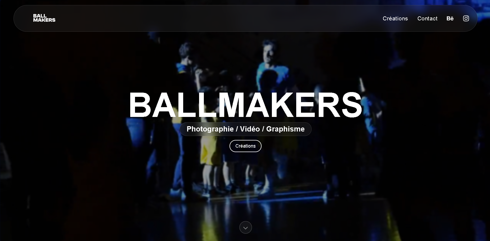
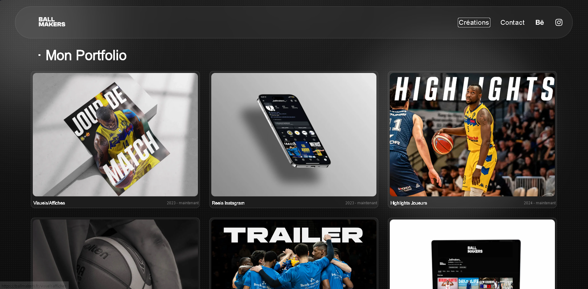
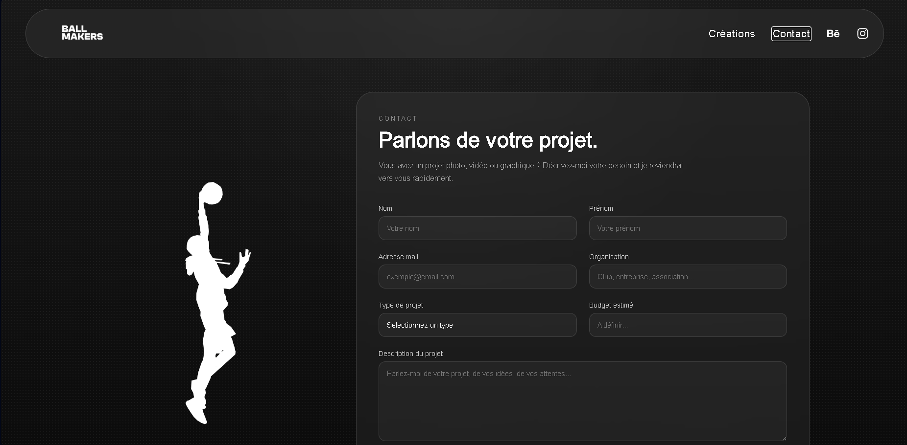
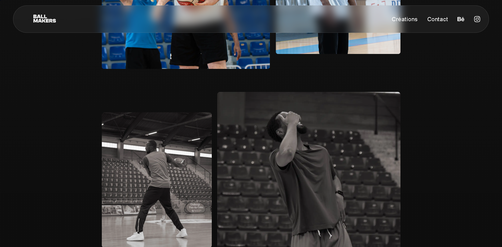

# 🏀 BallMakers

Site web réalisé pour **BallMakers**, spécialisé dans la création de contenu autour du basketball : **photographie, vidéo et graphisme**.

Le projet avait pour objectif de créer une vitrine moderne permettant de présenter les réalisations, collaborations et services de BallMakers.

🌐 **Site en ligne : [ballmakers.fr](https://ballmakers.fr)**

---

## 📸 Aperçu

  

  
  
  

---

## ✨ Fonctionnalités

- 🎨 Présentation des créations et collaborations
- 📸 Galeries photos, carrousels et lightbox
- 🎬 Intégration de contenus vidéo
- 🌍 Interface disponible en **français et en anglais**
- 📩 Formulaire de contact relié à un backend
- 📱 Interface entièrement responsive

---

## 🛠️ Technologies

**Frontend :** React · JavaScript · CSS · i18next  
**Backend :** Node.js · API d'envoi d'e-mails  
**Déploiement :** Netlify

---

## 👨‍💻 Mon rôle

J'ai réalisé le développement du site seul, de la création de la maquette jusqu'à la mise en ligne.

Le projet m'a notamment permis de travailler sur la création d'un site adaptée à l'identité visuelle du client, de savoir m'adapter en fonction de ses besoins et l'intégration de contenus multimédias optimisés.

---

## 🔒 Code source

Ce projet ayant été réalisé pour un client, son code source n'est pas disponible publiquement.

Ce repository a uniquement pour objectif de présenter le projet, les technologies utilisées et quelques aperçus de l'interface.

---

  Développé par <strong>Pierre Deldalle</strong> pour <strong>BallMakers</strong>.

